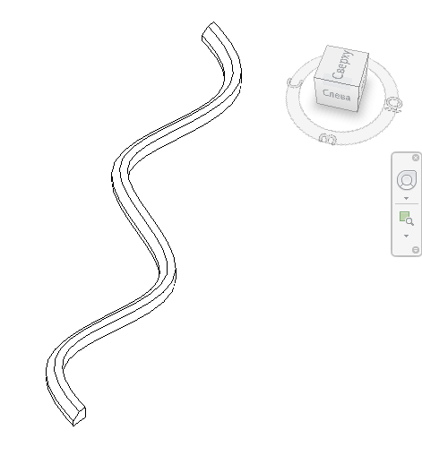

# This repository contains different simple and effective solutions

#### Revit Add-In that creates loft with given profile by path, defined by Sin(x) function

Look at this [project](src/CreateLoftWithSinusProfile/CreateLoftWithSinusProfile.csproj)

This is result direct shape geometry:
